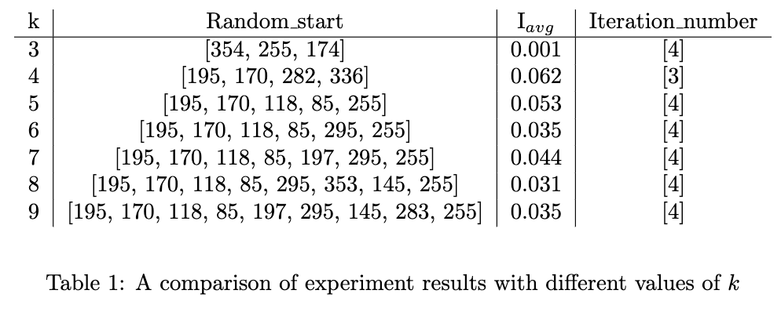
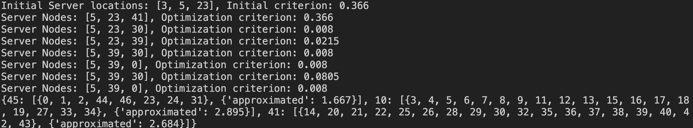

# Gravitational Potemtial method for Network Optimization
This repository contatins code for the "Gravitational potential method and its application to network optimization" Bachelor Thesis.

It consists of five main parts:

* **main.py** and **optimization_for_diff_k.py** --- main modules, which perform the optimization for fixed number of servers and compare the results for different number of servers respectively.
* **flow.py** --- module, where the first part of the optimization is implemented.
* **mds.py** --- module, where the second part of the algorithm (finding the centroid node, which minimizes the paths' sum in the cluster) is implemented.
* **graph_models.py** --- module, where the requierd FlowGraph class is defined along with some models of graphs (balanced_tree, balanced_tree, random_powerlaw_tree. etc.)
* **utils_** --- directory with helper modeules 

## How to use

0. Install the required packages with `python install -r requirements.txt`

1. Create the desired graph model (instance of FlowGraph class, or select from already created in **graph_models.py**). 
The graph can be created from the edgelist as well as from the adjacency matrix (parameters ***edgelist***, ***adj_matrix***).

2. Pass the created graph to https://github.com/PhantomOfTheOpera/GravitationalNetworkOptim/blob/991c1ad4fd0fa279eab8e47f2ccf04d71b145e1c/main.py#L137 or https://github.com/PhantomOfTheOpera/GravitationalNetworkOptim/blob/991c1ad4fd0fa279eab8e47f2ccf04d71b145e1c/optimization_for_diff_k.py#L10 respectively.

3. Run the desired file with `pyhton main.py` or  `pyhton optimization_for_diff_k.py`.

## Interpretation of outputs
### Module optimization_for_diff_k.py

The output is a table generated in LaTex (just compile the output in the terminal as a LaTex file). The table looks like this:

  

### Module main.py

After defining the graph and setting the number of servers (`k`) the file generates output in format:

  

As set to default, the module calculates the result of optimization algorithm. If needed to compare with actual optimal results, computed by brute-force method, please set `compare = True` in https://github.com/PhantomOfTheOpera/GravitationalNetworkOptim/blob/991c1ad4fd0fa279eab8e47f2ccf04d71b145e1c/main.py#L54
This way, the output will include the optimal result for server center locations (second-step optimization). If the optimal results of first step optimization are also required, please uncomment the line https://github.com/PhantomOfTheOpera/GravitationalNetworkOptim/blob/991c1ad4fd0fa279eab8e47f2ccf04d71b145e1c/main.py#L147

Please note that for large graphs and for k > 5 (approx.) the brute-force method has high complexit and thus it may a lot of time to compute, therefore by default such comparison is excluded.
